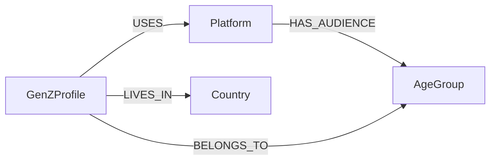

## Neo4J - Análise de Dados com Grafos.


---

# Analisando Dados de Redes Sociais com Grafos

Modelagem em grafo (Neo4j) para cruzar alcance global de plataformas de redes sociais com padrões de comportamento digital da Geração Z, respeitando os limites operacionais do AuraDB Free.

---

## 1. Problema

Marketing, product analytics e planejamento de conteúdo precisam responder três perguntas de forma rápida e visual: quais plataformas concentram maior alcance, quais faixas etárias dominam cada rede, e quais perfis Gen Z apresentam padrões de uso mais intensos (uso noturno, tempo de tela, sinais de queda de bem-estar). Hoje essas respostas exigem cruzar múltiplas planilhas manualmente — um processo lento e propenso a erro quando o objetivo é priorizar campanhas por país, idade e plataforma.

## 2. Contexto

O projeto combina duas fontes complementares:

- **Global Social Media Users by Age Gender 2025** — leitura macro por plataforma: MAU (Monthly Active Users), distribuição por gênero e faixa etária, notas de tendência por rede.
- **Gen-Z Social Media Usage Dataset** — 1 milhão de linhas com país, gênero, plataforma principal, propósito de uso, tempo diário, duração de sessão, uso noturno, saúde mental e nível de vício.

Esse é um domínio relacional por natureza: uma plataforma atende várias faixas etárias, um perfil de uso se conecta a uma plataforma e a um país, e o valor analítico está nas relações entre essas dimensões — não em cada tabela isolada. É esse padrão de conexão que justifica um banco de grafos em vez de uma abordagem tabular tradicional.

## 3. Baseline

Hoje essa análise não existe de forma estruturada: o cruzamento entre alcance de plataforma, demografia e comportamento Gen Z é feito manualmente, plataforma por plataforma, sem um modelo que permita navegar as relações entre país, faixa etária e intensidade de uso em uma única consulta. O grafo substitui esse processo manual por consultas de negócio reutilizáveis (seção 8).

## 4. Premissas

- O dataset global é adequado para análise de audiência por plataforma; o dataset Gen-Z, por ter 1 milhão de linhas, não é adequado para virar um grafo literal (nó a nó) dentro do limite do AuraDB Free.
- Para respeitar o plano gratuito, o projeto usa modelagem híbrida: dimensões de baixa cardinalidade (`Platform`, `Country`, `AgeGroup`) viram nós; perfis de comportamento agregados viram nós `GenZProfile`/`UsageProfile`; métricas contínuas ficam como propriedades.
- O foco é análise exploratória e consultas de negócio — não há, nesta fase, treinamento de modelo preditivo.
- Estimativas de mercado citadas neste documento (volume global e nacional de usuários ativos) são contexto qualitativo, não métricas do projeto, e não substituem os números extraídos diretamente dos datasets.

## 5. Estratégia

1. **Entendimento dos dados** — leitura dos ZIPs do Kaggle, inspeção de colunas, cardinalidade e qualidade.
2. **Limpeza e normalização** — correção do CSV global (linhas irregulares), padronização de campos numéricos e textuais, agregação do dataset Gen-Z em perfis analíticos.
3. **Modelagem do grafo** — definição de `Platform`, `AgeGroup`, `Country`, `GenZProfile`.
4. **Carga no AuraDB Free** — via `LOAD CSV` com URLs públicas (GitHub raw) ou Neo4j Data Importer, com constraints de unicidade.
5. **Consultas de negócio** — audiência por plataforma, distribuição por faixa etária, intensidade de uso por país, relação entre nível de vício, uso noturno e saúde mental.

## 6. Arquitetura

```text
Dados brutos (Kaggle)
      ↓
Validação e normalização (Python / Pandas)
      ↓
Amostragem e agregação (respeitando limites do AuraDB Free)
      ↓
Carga no Neo4j (LOAD CSV / Data Importer + constraints)
      ↓
Consultas de negócio (Cypher)
      ↓
Insights
```

**Modelo do grafo:**



- `Platform` guarda alcance global e recorte por faixa etária.
- `AgeGroup` organiza a demografia por grupo.
- `GenZProfile` concentra os sinais de comportamento individual/agregado da Gen Z.
- `Country` permite análises geográficas sem explodir a cardinalidade do grafo.

**Estrutura do repositório:**

```text
.
├── assets/          # esquema visual do grafo
├── cypher/          # constraints, cargas e consultas de negócio
├── data/
│   ├── raw/          # datasets originais (não versionados)
│   ├── processed/     # CSVs limpos
│   └── samples/       # amostras usadas na demonstração
├── docs/           # contexto, modelo, arquitetura, troubleshooting, reprodutibilidade
├── evidencias/       # capturas do Neo4j Browser/Bloom
├── scripts/         # preparação e agregação dos dados
├── README.md
└── .gitignore
```

## 7. Decisões Técnicas e Trade-offs

| Decisão | Benefício | Trade-off |
|---|---|---|
| Amostragem do dataset Gen-Z (1M → subconjunto controlado) | Respeita o limite gratuito do AuraDB | Não representa o milhão de linhas completo no grafo |
| Nós de referência (`Platform`, `Country`, `AgeGroup`) em vez de duplicar atributos | Reuso e travessia mais eficientes | Modelo com mais níveis de indireção |
| `GenZProfile` como perfil técnico/agregado | Preserva sinais estatísticos sem violar limites de nós | Não representa usuários individuais reais |
| Scripts Cypher separados por responsabilidade (constraints, carga, consultas) | Manutenção e leitura mais simples | Mais arquivos para navegar |
| CI leve (lint + testes de qualidade de dados via pytest) mantido no projeto, sem pipeline de deploy | Garante que os CSVs de amostra nunca quebrem silenciosamente | Escopo de automação deliberadamente contido — este projeto roda em tier gratuito e não é um sistema em produção; um pipeline de deploy completo seria over-engineering para o estágio atual |

## 8. Resultados

Consultas de negócio implementadas e validáveis no AuraDB Free:

- **Alcance x sinal jovem por plataforma** — cruza MAU global com peso demográfico por faixa etária.
- **Faixas etárias dominantes por plataforma** — distribuição percentual por gênero e idade.
- **Perfis Gen Z mais intensos** — ordena por volume amostral, uso diário médio e duração de sessão.
- **Uso mais pesado por país x plataforma** — combina uso diário, duração de sessão, tempo de tela pré-sono e score médio de saúde mental.

Na amostra local do dataset Gen-Z, os padrões mais consistentes observados foram: uso médio diário próximo de 3,5 horas; TikTok, Instagram e YouTube como plataformas líderes; alta concentração de uso noturno; e queda no score de saúde mental à medida que o nível de vício sobe. Estes números refletem a amostra utilizada no projeto, não o dataset completo de 1 milhão de linhas.

## 9. Impacto / Business Performance

O modelo em grafo reduz um cruzamento que hoje é manual (planilha por plataforma, faixa etária e país) para consultas Cypher reutilizáveis, permitindo que áreas de marketing e product analytics priorizem campanhas por país/idade/plataforma sem depender de um analista para recompilar a análise a cada pergunta. 

Por rodar inteiramente em AuraDB Free, a infraestrutura do banco utiliza o tier gratuito do Neo4j AuraDB para fins educacionais e de demonstração, sem custo direto de licenciamento no escopo atual — o trade-off documentado (seção 7) é a amostragem, não a qualidade da resposta de negócio.

## 10. Próximos Passos

- Adicionar visualizações do Neo4j Browser/Bloom como evidência.
- Publicar os CSVs processados em URL pública para carga direta via `LOAD CSV`.
- Expandir com Neo4j Graph Data Science (GDS) para centralidade e detecção de comunidades.
- Criar notebook de EDA com gráficos comparativos entre os dois datasets.
- Avaliar evolução para Neo4j Enterprise/Aura pago caso o volume de dados de produção supere os limites do free tier documentados na seção 7.

---


[](https://portfoliosantossergio.vercel.app)
[](https://linkedin.com/in/santossergioluiz)


