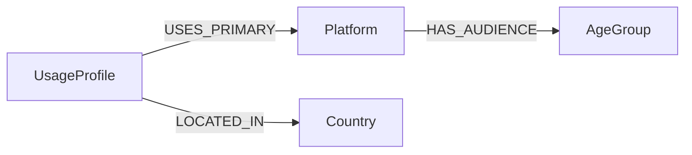

## Neo4J - Análise de Dados com Grafos.


---


# Analisando Dados de Redes Sociais com Grafos

Projeto em Neo4j para analisar redes sociais com foco em demografia, alcance de plataformas e comportamento digital da Gen Z.

## 1. Problema de negócio

Como identificar, de forma rápida e visual, quais redes sociais concentram maior alcance, quais faixas etárias dominam cada plataforma e quais perfis Gen Z apresentam padrões de uso mais intensos?

A resposta ajuda em:
- marketing e mídia
- product analytics
- planejamento de conteúdo
- análise de comportamento digital
- priorização de campanhas por país, idade e plataforma

## 2. Contexto

O projeto usa dois datasets complementares:

- **Global Social Media Users by Age Gender 2025**
  - leitura macro por plataforma
  - faixa etária
  - distribuição de gênero
  - notas de tendência por rede

- **Gen-Z Social Media Usage Dataset**
  - 1 milhão de linhas
  - país
  - gênero
  - plataforma principal
  - propósito de uso
  - tempo diário
  - duração média de sessão
  - uso noturno
  - saúde mental
  - nível de addiction

O tema é relevante porque social media segue em escala massiva. Em 2026, estimativas amplamente usadas no mercado mostram bilhões de identidades ativas em redes sociais no mundo e cerca de 150 milhões de identidades no Brasil.

## 3. Premissas

- O dataset global é mais adequado para análise de audiência por plataforma.
- O dataset Gen-Z é grande demais para virar um grafo literal com 1 milhão de nós em AuraDB Free.
- Para respeitar o plano gratuito, o projeto usa uma modelagem híbrida:
  - dimensões de baixa cardinalidade viram nós
  - perfis analíticos agregados viram `UsageProfile`
- Métricas contínuas ficam como propriedades dos perfis.
- O foco do projeto é análise exploratória e consultas de negócio, não treinamento de modelo preditivo.

## 4. Por que Neo4j

Este problema é relacional por natureza:
- uma plataforma atende várias faixas etárias
- um perfil de uso se conecta a uma plataforma e a um país
- o valor está nas relações entre dimensões

Grafos permitem responder perguntas como:
- qual plataforma concentra mais alcance?
- qual faixa etária domina cada rede?
- quais perfis combinam maior uso diário, mais uso noturno e menor bem-estar digital?

## 5. Estratégia da solução

### Etapa 1 — Entendimento dos dados
- leitura dos ZIPs do Kaggle
- inspeção de colunas, cardinalidade e qualidade dos arquivos

### Etapa 2 — Limpeza e normalização
- correção do CSV global, que possui linhas irregulares
- padronização dos campos numéricos e textuais
- agregação do dataset Gen-Z em perfis analíticos

### Etapa 3 — Modelagem do grafo
- `Platform`
- `AgeGroup`
- `Country`
- `UsageProfile`

### Etapa 4 — Carga no AuraDB Free
- uso de `LOAD CSV`
- uso de URLs públicas do GitHub raw ou do Neo4j Data Importer
- constraints para garantir qualidade e performance

### Etapa 5 — Consultas de negócio
- audiência por plataforma
- distribuição por faixa etária
- intensidade de uso por país
- relação entre addiction level, uso noturno e saúde mental

## 6. Modelo do grafo



### Leitura do modelo
- `Platform` guarda alcance global e recorte por faixa etária
- `AgeGroup` organiza a demografia por grupo
- `UsageProfile` concentra os sinais de comportamento da Gen Z
- `Country` permite análises geográficas sem explodir a cardinalidade

## 7. Arquivos do repositório

```text
.
├── assets/
├── cypher/
├── data/
│   ├── processed/
│   ├── raw/
│   └── samples/
├── docs/
├── scripts/
├── README.md
└── .gitignore
```

### Principais arquivos
- `scripts/prepare_datasets.py` — limpa e agrega os ZIPs do Kaggle
- `cypher/00_constraints.cypher` — constraints e índices
- `cypher/01_load_global_demographics.cypher` — carga do dataset global
- `cypher/02_load_genz_profiles.cypher` — carga do dataset Gen-Z agregado
- `cypher/03_business_queries.cypher` — consultas de negócio
- `assets/neo4j_schema.png` e `assets/neo4j_schema.svg` — esquema visual
- `evidencias/` — capturas do Neo4j Browser/Bloom e export do schema

## 8. Como executar

1. Baixe os ZIPs do Kaggle.
2. Coloque os arquivos em `data/raw/`.
3. Rode:

```bash
python scripts/prepare_datasets.py
```

4. Publique os CSVs processados em um local `http(s)` acessível ao Aura, ou use o Neo4j Data Importer.
5. Execute os scripts Cypher no Neo4j Browser.

## 9. Importação no AuraDB Free

Para ambientes cloud, a Neo4j orienta o uso de fontes remotas `http(s)` ou do Data Importer para carregar CSVs. Isso combina bem com este projeto, porque os CSVs processados podem ser publicados no próprio GitHub e consumidos por `LOAD CSV`.

## 10. Insights esperados

Na análise local do dataset Gen-Z, os padrões mais fortes aparecem em:
- uso médio diário em torno de 3,5 horas
- TikTok, Instagram e YouTube como plataformas líderes
- alta concentração de uso noturno
- queda de saúde mental conforme o nível de addiction sobe

## 11. Consultas de negócio

### 11.1 Quais plataformas têm maior alcance e maior sinal jovem?
```cypher
MATCH (p:Platform)-[r:HAS_AUDIENCE]->(a:AgeGroup)
WITH p, sum(coalesce(r.female_pct, 0) + coalesce(r.male_pct, 0)) AS youth_signal
RETURN p.name AS platform, p.mau_billion AS mau_billion, youth_signal
ORDER BY mau_billion DESC, youth_signal DESC;
```

### 11.2 Quais faixas etárias dominam cada plataforma?
```cypher
MATCH (p:Platform)-[r:HAS_AUDIENCE]->(a:AgeGroup)
RETURN p.name, a.label, r.female_pct, r.male_pct, r.notes
ORDER BY p.name, a.sort_order;
```

### 11.3 Quais perfis Gen Z são mais intensos em uso?
```cypher
MATCH (u:UsageProfile)
RETURN u.country, u.primary_platform, u.purpose, u.addiction_level,
       u.sample_count, u.avg_daily_usage_hours, u.avg_session_minutes,
       u.avg_mental_health_score, u.avg_screen_time_before_sleep
ORDER BY u.sample_count DESC
LIMIT 25;
```

### 11.4 Onde o uso é mais pesado?
```cypher
MATCH (u:UsageProfile)-[:LOCATED_IN]->(c:Country),
      (u)-[:USES_PRIMARY]->(p:Platform)
RETURN c.name AS country,
       p.name AS platform,
       avg(u.avg_daily_usage_hours) AS avg_daily_usage_hours,
       avg(u.avg_session_minutes) AS avg_session_minutes,
       avg(u.avg_screen_time_before_sleep) AS avg_screen_time_before_sleep,
       avg(u.avg_mental_health_score) AS avg_mental_health_score,
       sum(u.sample_count) AS population
ORDER BY population DESC, avg_daily_usage_hours DESC
LIMIT 25;
```

## 12. Troubleshooting

- **CSV global com linhas irregulares**: o script de preparação normaliza as linhas antes de salvar o CSV limpo.
- **Limite do AuraDB Free**: o dataset Gen-Z é agregado para ficar dentro do limite de nós e relacionamentos.
- **Importação no Aura**: o projeto foi pensado para `LOAD CSV` com URL pública ou para o Neo4j Data Importer.


## Resumo da Análise dos Datasets
​**data/samples/global_social_media_users_by_age_gender_2025_clean.csv:**

Contém 85 registros cobrindo 25 plataformas globais (como Facebook, Instagram, TikTok e YouTube). Mapeia métricas de MAU (Monthly Active Users) em bilhões, distribuição percentual por gênero e faixas etárias.  

**data/samples/genz_social_media_usage_sample_1000.csv:**

Base amostral individual com 1.000 observações de jovens de 13 a 27 anos em 7 países. Captura horas de uso diário, score de saúde mental (1 a 10), tempo de tela pré-sono e nível de vício.  


**data/samples/genz_profile_aggregation_sample_500.csv:**

Versão agregada com 500 perfis consolidados por combinações demográficas e comportamentais. Otimizada para o modelo de grafos no Neo4j AuraDB Free por agrupar amostras mantendo médias ponderadas.  


## Modelagem de Grafo

```

 (:Country) <---[:LIVES_IN]--- (:GenZProfile) ---[:USES {is_primary: true}]---> (:Platform)
                                      |                                              |
                                      +--------[:BELONGS_TO]--------> (:AgeGroup) <--+
                                                                             ^
                                                                             |
                                                                     [:HAS_AUDIENCE]


```


---

   


## 13. Próximos passos

- adicionar visualizações do Neo4j Browser/Bloom
- incluir export da visualização do esquema como evidência
- publicar os CSVs processados em URL pública
- expandir com Neo4j GDS para centralidade e comunidades
- criar um notebook com EDA e gráficos comparativos

## 14. Autor

Sérgio Santos
